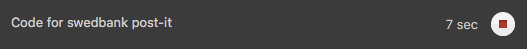
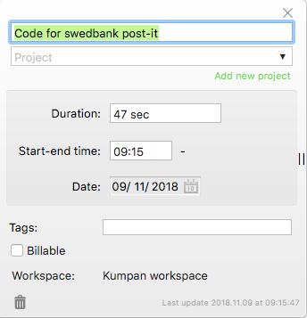
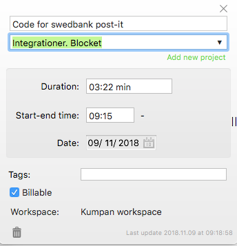

# Toggl

We all use Toggl to track our time. It has [android](https://play.google.com/store/apps/details?id=com.toggl.giskard) / [iPhone](https://toggl.com/mobile-time-tracking-app/) / [desktop](https://toggl.com/toggl-desktop/) / Chrome addon

When you start working on something first write what you are doing.
Eg.

It is also extremly important that you pick a client and a project. If you do not know what project / client to "toggl" on, ask one of your colleagues. This is important since we need this information in our billing.

Example without client / project

Example with client / project

If you are working on something that's not related to a client you can "toggl" on the project `misc` or `misc kod` on the client Kumpan.
